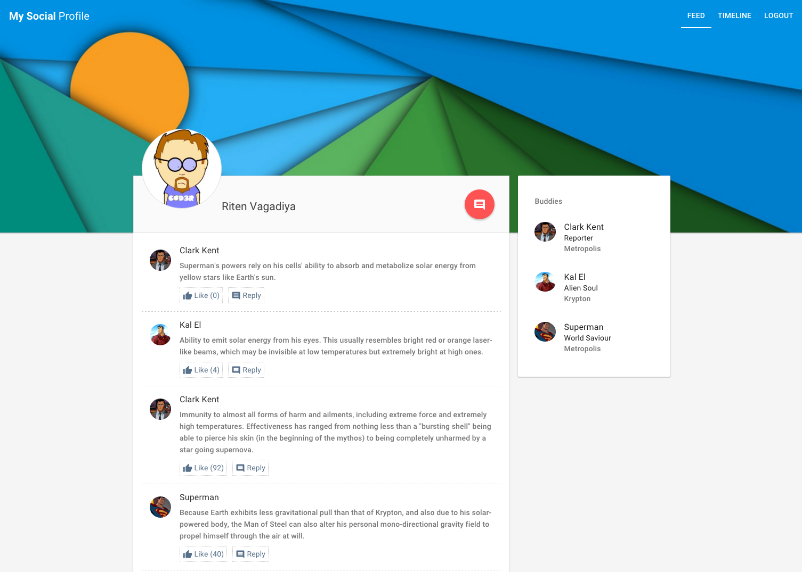
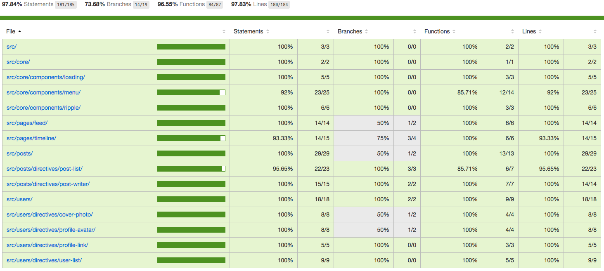

# My Social Profile

This project is a *basic* social profile with posts and friends list, built using AngularJS.

### How does it look?

Below is a screenshot of the app:



## Getting Started

#### Prerequisites

1. git [http://git-scm.com/](http://git-scm.com/)
2. node & npm [http://nodejs.org/](http://nodejs.org/)

#### Clone The App

To get you started you can simply clone `master` branch from the
[My Social Profile](https://github.com/ritenv/my-social-profile) repository and install the dependencies:

Clone the repository using [git][git]:

```
git clone https://github.com/ritenv/my-social-profile.git
cd my-social-profile
```

#### Installing Dependencies

There are two kinds of dependencies in this project: tools and AngularJS framework code. The tools help us manage and test the application.

* Get the tools via `npm`
* Get the AngularJS code via `bower`

`npm` is preconfigured to automatically run `bower` so you can simply do:

```
npm install
```

Behind the scenes this will also call `bower install`.  You should find that you have two new
folders in your project.

* `node_modules` - contains the npm packages for the tools we need
* `app/bower_components` - contains the AngularJS framework files

### Run The App

Like any web app, this app needs a web server to run properly. In order to do this, simply install the lightweight web server with:

```
npm install -g live-server
```

To run the server, go to the /app directory and run the `live-server` command:

```
cd ./app; live-server;
```

### Run Unit Tests

To run your unit tests, simply run these terminal commands:

```
npm test
```

The coverage report will be generated under `./coverage`, you can view the `index.html` file.



## Directory Layout

```
app/                    --> all of the source files for the application
  assets/app.css        --> default stylesheet
  src/*           --> all app specific modules
  content/*           --> sample content for this test app
  index.html            --> app layout file (the main html template file of the app)
  config/karma.conf.js         --> config file for running unit tests with Karma
```

## Features & Explanations

The app currently features the following elements:

1. The feed view

	This view shows the logged-in user's feeds and friends. There is also an ability to write a new status.
	The app is built to be responsive, so on smaller screen sizes, the friends list will be hidden as a side navigation.

	Clicking on a friend from the friend's list (or by clicking name / photo from the feed list), that specific user's timeline will be shown.

2. The timeline view

	This view shows the posts written by a specific user. There is also a `me` page which shows the logged-in user's timeline. The `me` page can be accessed by clicking *Timeline* on the main menu.

3. Fancy features

	- Each user's timeline, or the feed, features a cover photo
	- Writing a new post will highlight that post for a while
	- The cover photo will generate a ripple, and also generate the ripple on switching views from the menu

[git]: http://git-scm.com/
[bower]: http://bower.io
[npm]: https://www.npmjs.org/
[node]: http://nodejs.org

## General Architecture

- The app is architected via various, multiple directives.
- Each directive (almost) is well tested with supportive unit tests.
- Unit tests are also written for controllers and services, wherever applicable.
- Modules in `./app/src/` mainly define directives. The directives are essentially knit together in `./app/src/pages/`, each `page` module is a representation of a complete view (e.g. feed, timeline).
- Shared components / directives are located in `./app/src/core/`, namely `loading`, `menu` and `ripple` (an interesting directive to add ripples to anything upon clicking).

## Technology & Tools

* **AngularJS**: The app is built upon AngularJS as the base frontend framework http://angularjs.org/
* **Angular Material**: The UI components and layout is built upon the material design implementation by Angular https://material.angularjs.org/
* **Karma**: The tests are run using karma test runner
* **Jasmine**: The tests are written using Jasmine as the testing framework
* **Coverage**: Test coverage report will be generated in the ./coverage directory upon running the tests
* **App Data**: All data is loaded from static JSON files under `./dev`

## With More Time

Provided with more time, below could enhance the application further:
- Write end-to-end tests
- Complete remaining unit tests (97% coverage currently)
- Add CSS3 animations (ngAnimate module already added) to prevent page stagger
- Add build tools for generating a `dist` version (minified, uglified version)
- Use $templateCache to preload .html all partial views

## Credits

- All photos taken from [DuckDuckGo images](https://duckduckgo.com/?q=material+design+wallpapers&iax=1&ia=images)
- Superman superpowers taken from [Wikipedia](https://en.wikipedia.org/wiki/Powers_and_abilities_of_Superman)

## Background

**My Social Profile** is developed by [@ritenv](http://twitter.com/@ritenv) out of his spare time. If you have any ideas, suggestions or things you'd like to see in this app, PM me directly at [@ritenv](http://twitter.com/@ritenv).